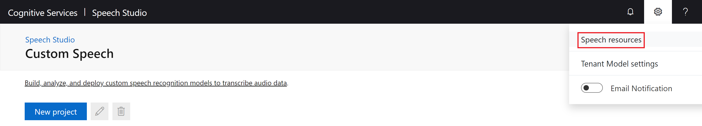
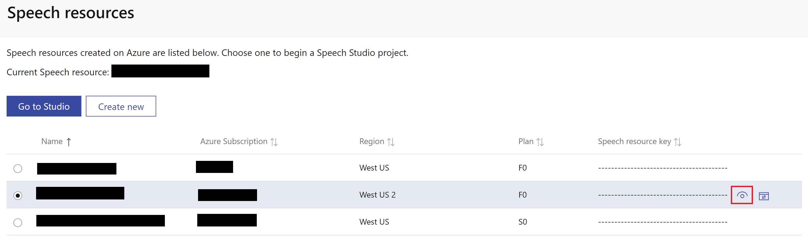

# 1. Project Setup

Create the Azure resources and set up Git to begin developing Custom Speech models.

### Table of Contents

* [Create the Resource Group and Resources](#Create-the-Resource-Group-and-Resources)
* [Create the Speech Project](#Create-the-Speech-Project)
* [Create the Service Principal](#Create-the-Service-Principal)
* [Validate GitHub Secrets](#Validate-GitHub-Secrets)
* [Install Git Large File Storage](#Install-Git-Large-File-Storage)
* [Protect the Master Branch](#Protect-the-Master-Branch)
* [Next Steps](#Next-Steps)

## Create the Resource Group and Resources

Developing Custom Speech models with the CI/CD pipeline requires an Azure Resource Group, under which an Azure Speech Resource and an Azure Storage Account must be created. To create these resources, click the Deploy to Azure button below:

[](https://portal.azure.com/#create/Microsoft.Template/uri/https%3A%2F%2Fraw.githubusercontent.com%2FKatieProchilo%2FCustomSpeechDevOpsSample%2Fmaster%2Fazuredeploy.json)

Enter the values as follows and save them for later use:

* **Resource Group:** Up to 90 alphanumeric characters, periods, underscores, hyphens and parenthesis. Cannot end in a period.
* **Location:** Select the region from the dropdown that's best for your project.
* **STORAGE_ACCOUNT_NAME:** 8-24 alphanumeric characters. Must be unique across Azure.
    * [Create a GitHub Secret](https://help.github.com/en/actions/configuring-and-managing-workflows/creating-and-storing-encrypted-secrets#creating-encrypted-secrets) called `STORAGE_ACCOUNT_NAME` and set it to this value.
* **STORAGE_ACCOUNT_REGION:** Select the region from the dropdown that's best for your project.
* **SPEECH_RESOURCE_NAME:** 2-64 alphanumeric characters, underscores, and hyphens.
* **SPEECH_RESOURCE_REGION:** Select the region from the dropdown that's best for your project.
    * [Create a GitHub Secret](https://help.github.com/en/actions/configuring-and-managing-workflows/creating-and-storing-encrypted-secrets#creating-encrypted-secrets) called `SPEECH_RESOURCE_REGION` and set it to this value.

Agree to the terms and click **Purchase** to create the Resource Group and Resources. Fix any validation errors if necessary.

## Create the Speech Project

Navigate to the [Speech Studio](https://speech.microsoft.com/portal/) and click the cog in the upper right corner, then click **Speech resources**:



Select the Speech Resource that was created in Project Setup, and then click the eye icon to see the Speech subscription key. [Create a GitHub Secret](https://help.github.com/en/actions/configuring-and-managing-workflows/creating-and-storing-encrypted-secrets#creating-encrypted-secrets) called `SPEECH_SUBSCRIPTION_KEY`, and set it to this value:



[Create a Speech project](https://docs.microsoft.com/en-us/azure/cognitive-services/speech-service/how-to-custom-speech#how-to-create-a-project) under this Speech Resource. [Create a GitHub Secret](https://help.github.com/en/actions/configuring-and-managing-workflows/creating-and-storing-encrypted-secrets#creating-encrypted-secrets) called `SPEECH_PROJECT_NAME` and set it to the name of the project you created.

## Create the Service Principal

[Azure Service Principals](https://docs.microsoft.com/en-us/cli/azure/create-an-azure-service-principal-azure-cli?toc=%2Fazure%2Fazure-resource-manager%2Ftoc.json&view=azure-cli-latest) give role-restricted access to Azure Resources. The service principal you will create will be used to log in to Azure in the workflow.

[Install the Azure CLI](https://docs.microsoft.com/en-us/cli/azure/install-azure-cli?view=azure-cli-latest) and log in to Azure:

```bash
az login
```

Execute the following command to confirm you are in the correct Azure Subscription:

```bash
az account show
```

If you have more than one subscription and the incorrect subscription is selected, set the right subscription with:

```bash
az account set -s <<NAME_OR_ID_OF_SUBSCRIPTION>>
```

Using the Resource Group name from before, substitute the appropriate values and run the command to create the service principal. Its name must be unique across Azure:

```bash
az ad sp create-for-rbac --name <<SERVICE_PRINCIPAL_NAME>> --role "Storage Blob Data Contributor" --scopes /subscriptions/<<SUBSCRIPTION_ID>>/resourceGroups/<<RESOURCE_GROUP_NAME>> --sdk-auth
```

[Create a GitHub Secret](https://help.github.com/en/actions/configuring-and-managing-workflows/creating-and-storing-encrypted-secrets#creating-encrypted-secrets) called `AZURE_CREDENTIALS` and set it to the JSON output from the command, for example:

```json
{
  "clientId": "########-####-####-####-############",
  "clientSecret": "########-####-####-####-############",
  "subscriptionId": "########-####-####-####-############",
  "tenantId": "########-####-####-####-############",
  "activeDirectoryEndpointUrl": "https:...",
  "resourceManagerEndpointUrl": "https:...",
  "activeDirectoryGraphResourceId": "https:...",
  "sqlManagementEndpointUrl": "https:...",
  "galleryEndpointUrl": "https:...",
  "managementEndpointUrl": "https:..."
}
```

## Validate GitHub Secrets

GitHub Secrets serve as parameters to the workflow, while also hiding secret values. When viewing the logs for a workflow on GitHub, secrets will appear as `***`.

Ensure each of the following secrets have been set:


## Install Git Large File Storage

Custom Speech uses .wav audio files for both testing and training models. Storing these files in a Git repository is not common practice because simple actions like pulling or checking out are expensive. However, the testing and training data needs to be versioned and should be stored in some way that enables versioning. There are many possible solutions to this versioning problem, and one is [Git Large File Storage](https://git-lfs.github.com/).

Git LFS was chosen for this solution because the training and testing data can be stored in the same repository that the model is developed, making versioning and traceability easy to handle. Also, it doesn't require additional tooling; Git can be used in the same way it's always been used. Operations for large files are optimized to to occur only when the files are interacted with specifically.

Navigate to the root of the repository you cloned and install Git LFS:

```bash
git lfs install
```

Git LFS should manage all the testing and training data. Additional files can be configured at any time, but to manage the data as it is currently set up:

```bash
git lfs track "testing/**" "training/**"
```

Now add `.gitattributes` as a tracked file and push the changes to your repository:

```bash
git add .gitattributes
git commit -m "Set up Git LFS."
git push
```

If needed, [purchase more large file storage](https://help.github.com/en/github/setting-up-and-managing-billing-and-payments-on-github/upgrading-git-large-file-storage) through GitHub.

Now, Custom Speech models can be quickly developed with traceability between the models created, the data that trained each model, and the data each model was tested on.

## Protect the Master Branch

This solution uses [GitHub Flow](https://guides.github.com/introduction/flow/), which involves creating feature branches and merging them into **master**. This approach is lightweight, but illustrates the basics of protecting branches. To protect multiple or different branches like **master** and **develop** read about [Changing Branch Configurations](4-advanced-customization.md#Changing-Branch-Configurations).

Branch policies should be configured to prevent direct pushes to the master branch. They should require changes to be checked in by creating a Pull Request and getting these changes approved by collaborators in the repository.

***Important:*** *Individual GitHub accounts must be public or have a GitHub Pro subscription to enforce branch protections. If you are using a private repository with a personal GitHub account, you will have to change your repository to be public in repository settings.*

To configure these protections:

1. In the home page for your repository, click **Settings**.
2. On the Settings page, click on **Branches** in the Options menu.
3. Under **Branch protection rules**, click the **Add rule** button.
4. Configure the rule:
    1. In the **Branch name pattern** box, enter **master**.
    2. Check **Require pull request reviews before merging**.
    3. Do **not** check **Include administrators**. Later you will need to use your administrator privileges to bypass merging restrictions. Once multiple people are contributing to the project, consider configuring these restrictions for administrators as well.
    4. Click the **Create** button at the bottom of the page.

## Next Steps

The project has now been set up and you can move on to [Create the Initial Custom Speech Model](./2-create-the-initial-custom-speech-model.md).